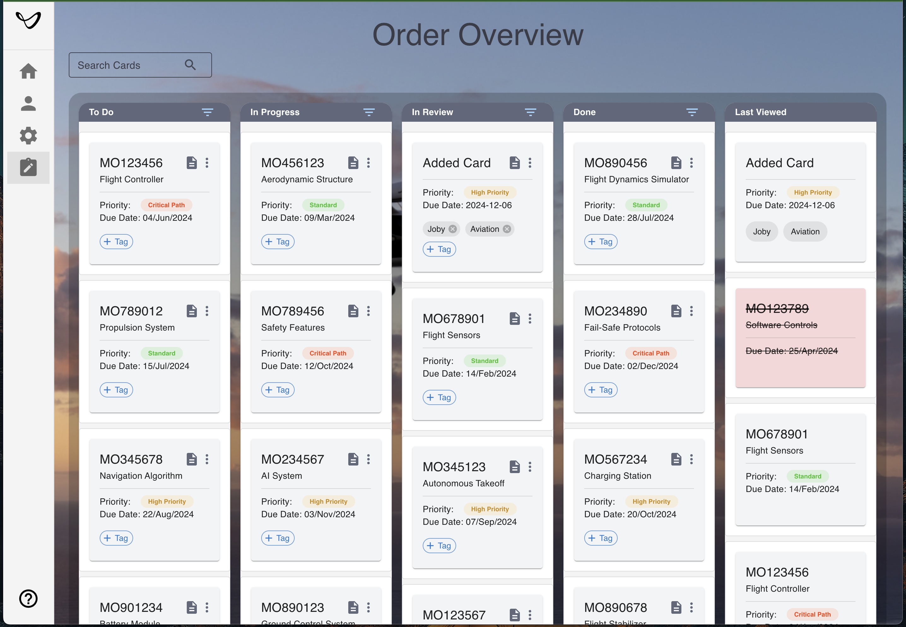
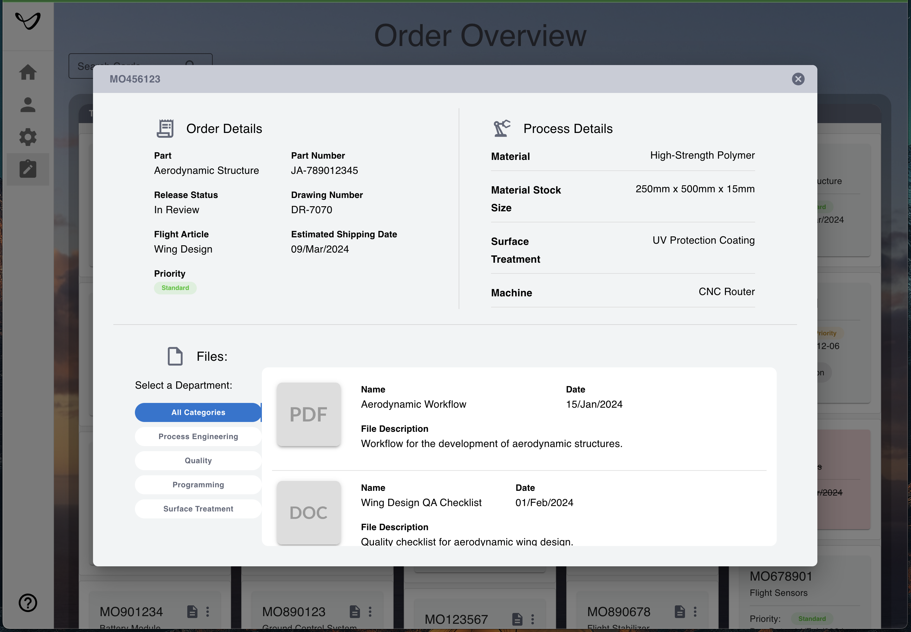

# 🗂️ Order Overview Application

## Table of Contents

- [🗂️ Order Overview Application](#️-order-overview-application)
  - [Table of Contents](#table-of-contents)
  - [📖 About](#-about)
  - [✨ Features](#-features)
    - [🛠️ **Board and Card Management**](#️-board-and-card-management)
    - [📌 **Column Functionalities**](#-column-functionalities)
    - [📋 **Card Functionalities**](#-card-functionalities)
  - [Preview](#preview)
    - [Kanban Board Overview](#kanban-board-overview)
    - [Order Details Modal](#order-details-modal)
  - [🛠️ Technical Stack](#️-technical-stack)
  - [📐 Object Structure and Data Source](#-object-structure-and-data-source)
    - [Note:](#note)
  - [🚀 Installation and Setup](#-installation-and-setup)
    - [Prerequisites](#prerequisites)
    - [Steps](#steps)
  - [🚀 Deployment](#-deployment)
  - [🔮 Future Enhancements (Additional)](#-future-enhancements-additional)
  - [📜 License](#-license)

## 📖 About

The **Order Overview Application** is a professional, feature-rich Kanban-style task management system designed to:

- 📝 Track and manage tasks.
- 🔄 Organize tasks by priority and status.
- 📁 Attach and organize detailed file information.

Built with **React**, **TypeScript**, and **Material-UI**, it offers a modern, responsive, and user-friendly interface for task management.

---

## ✨ Features

### 🛠️ **Board and Card Management**
- **🖱️ Smooth Drag-and-Drop**: Move cards between columns effortlessly for dynamic organization.
- **🔍 Search and Filter**: Quickly find cards displayed on the board (excludes priority-based searches).
- **📊 Columns**:
  - **Todo**, **In Progress**, **In Review**, and **Done**: Structured columns to manage tasks effectively.
  - **Last Viewed**:
    - Displays recently accessed cards for quick reference.
    - Highlights deleted cards with a distinct style for easy identification.

### 📌 **Column Functionalities**
- **🔃 Sorting**:
  - Sort cards by **date** or **priority** using column header controls.
  - Reset sorting options when needed.
- **➕ Add New Card**:
  - Located at the bottom of each column (except **Last Viewed**).
  - Opens a **modal form** to create new cards.
  - Required fields: **Title** and **Estimated Shipping Date**.

### 📋 **Card Functionalities**
- **📄 Order Details Modal**:
  - Accessed by clicking the document icon on a card.
  - Features:
    - Displays card details like title, date, and priority.
    - Files categorized by department or reset to show all files.
  - Fully responsive, ensuring usability across screen sizes, including tablets.
- **☰ Action Menu (Popover)**:
  - Accessed by clicking the vertical ellipsis icon on a card.
  - Options:
    - **✏️ Edit Card**:
      - Update card details (title, date, priority) in a modal.
      - Long titles are truncated with ellipsis and show full text on hover.
    - **🗑️ Delete Card**:
      - Removes the card from the column.
      - Deleted cards in the **Last Viewed** column are highlighted with a unique style.
  - **🎨 Priority Management**:
    - Change priority directly by interacting with the priority label.
  - **🏷️ Tag Management**:
    - Add tags by clicking the "+ Tag" chip.
    - Remove tags directly from the card interface.

---

## Preview

### Kanban Board Overview


### Order Details Modal



---

## 🛠️ Technical Stack

- **Frontend Framework**: React ⚛️
- **Language**: TypeScript 
- **UI Library**: Material-UI 🎨
- **State Management**: Zustand 
- **Code Formatting**: Prettier 🖋️
- **Linting**: ESLint 🚨
- **Testing**: Jest and React Testing Library 🧪

---

## 📐 Object Structure and Data Source

The data used in this application is fetched locally as mocked data. This approach ensures fast performance and allows for easy inspection, particularly suited for the purpose of this technical challenge. 

For this implementation, the data is not served through a remote API (e.g., GraphQL or REST) to focus on the UI/UX and functionality aspects. However, the architecture is flexible enough to integrate with a backend service in the future.

The application reads objects that are structured as follows:

```
{
  id: string;
  title: string;
  priority: string;
  estimatedShippingDate: string;
  orderDescription: string;
  orderDetails: {
    part: string;
    partNumber: string;
    releaseStatus: string;
    drawingNumber: string;
    flightArticle: string;
  };
  processDetails: {
    material: string;
    materialStockSize: string;
    surfaceTreatment: string;
    machine: string;
  };
  files: [
    {
      id: string;
      name: string;
      category: string;
      thumbnail: string;
      date: string;
      description: string;
      type: string;
    }
  ];
  tags: string[];
  isDeleted: boolean;
}
```

### Note:
- The data was generated using AI-based models for simulation purposes.
- This format ensures flexibility and scalability to support advanced features.

---

## 🚀 Installation and Setup

### Prerequisites
Ensure the following are installed:
- **Node.js**: `>=16.x` 
- **npm**: `>=7.x` 

### Steps

1. Clone the repository:
   ` git clone https://github.com/samimagine/joby_aviation.git `

2. Install dependencies:
  ` npm install `

3. Start the development server:
 ` npm start `

4. Run tests:
  ` npm test `

5. Build for production:
  ` npm run build `

---

## 🚀 Deployment

This application is deployed using **GitHub Pages** to make the static build accessible online. 

- **Deployment URL**: [https://samimagine.github.io/joby_aviation/](https://samimagine.github.io/joby_aviation/)
- **Static Build Location**: The static files are located in the `docs` folder of the repository, which is used as the source for the GitHub Pages deployment.
- **Deployment Tool**: Used `gh-pages` for an automated deployment process.
   
---

## 🔮 Future Enhancements (Additional)

- **🚀 Backend Integration with GraphQL**:
  - Have a backend service deployed online, utilizing **GraphQL** with **Apollo Server**, to enable efficient and seamless data fetching. 
  This will involve creating a schema to represent the Kanban data structure and defining resolvers to handle specific queries and mutations. By integrating this backend, the application will leverage the power of GraphQL to fetch only the necessary data, simplify complex data operations, and enhance scalability.
  
- **📦 Component Unification**:
  - Refactor and simplify reusable components such as titles, selects, tooltips, buttons and inputs for consistency.
  - With **Material UI Theme**, Centralize and enhance theme by defining reusable variables for colors, spacing, typography, and component-specific properties. This ensures consistent styling, scalability, and ease of maintenance across the application.

- **🎯 Advanced Drag-and-Drop**:
  - Allow cards to be dragged and dropped not just into columns but also reordered within the target column based on the position where they are dropped.
  (Currently, cards are moved to the bottom of the target column)

- **🧪 Extended Testing**:
  - Write more comprehensive test cases to cover edge cases, improve reliability, and ensure robustness across all features.

---

## 📜 License

This project is licensed under the **MIT License**. You are free to use, modify, and distribute this software, provided that proper credit is given to the original author. 
